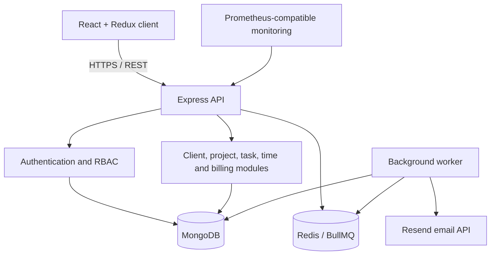

# WorkClub architecture

WorkClub is a modular MERN monolith with a separate background worker. This keeps deployment and
local development straightforward while preserving explicit domain boundaries that can be
extracted later if scale requires it.

## Trust boundaries

- The browser is untrusted. Navigation visibility is never treated as authorization.
- Every protected API request resolves the current user from a signed access token and active
  refresh session.
- Every operational query includes the authenticated `workspace` identifier.
- Member queries add project-team or task-assignee restrictions.
- Client users are routed only to `/api/portal`; internal tasks and comments are never selected.
- Billing time entries are reserved before invoice creation to prevent concurrent reuse.

## Runtime components

| Component | Responsibility |
| --- | --- |
| Frontend | React application, role-aware navigation and API consumption |
| API | Validation, authentication, tenant authorization and synchronous domain operations |
| Worker | Retried email delivery and recurring deadline/invoice sweeps |
| MongoDB | Durable workspace, identity, delivery and billing records |
| Redis | Durable BullMQ jobs, retries and scheduler coordination |
| Nginx | Static frontend delivery and same-origin `/api` proxy in containers |

## Authentication lifecycle

1. Login validates the bcrypt password hash.
2. A short-lived JWT access token is returned to application memory.
3. A random refresh token is stored only as an HttpOnly cookie.
4. Only the SHA-256 refresh-token hash is stored in MongoDB.
5. Refresh rotates the token atomically; replaying the old value fails.
6. Password reset revokes every active session.

## Data and indexes

Workspace-scoped compound indexes cover common project, task, invoice, notification, audit and
timesheet queries. Production startup disables automatic index creation; operators run
`npm run db:indexes --workspace backend` during a controlled deployment.

## Scale path

The API is stateless and can scale horizontally. Workers coordinate through Redis. MongoDB remains
the consistency boundary. If future load justifies extraction, notifications and billing are the
first suitable service boundaries because their contracts are already explicit.
